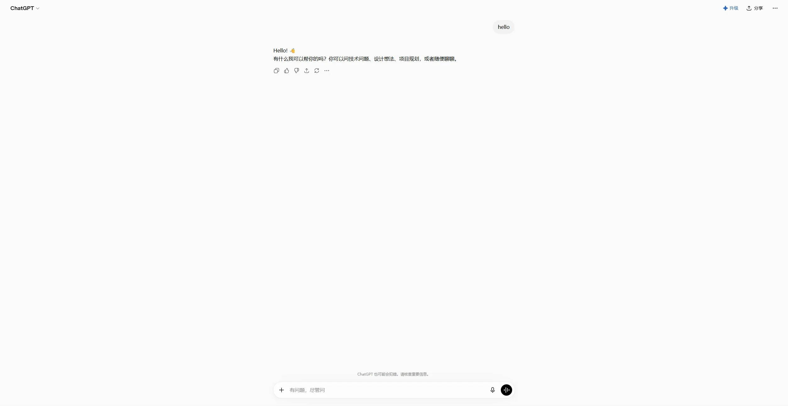
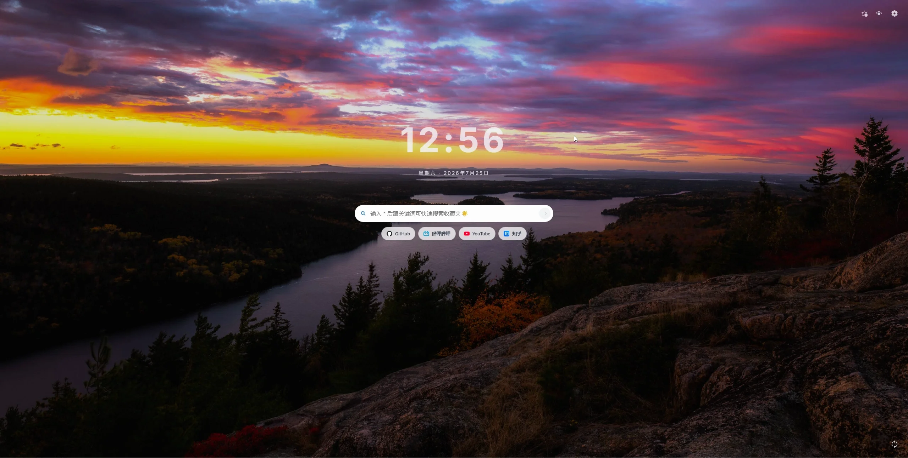
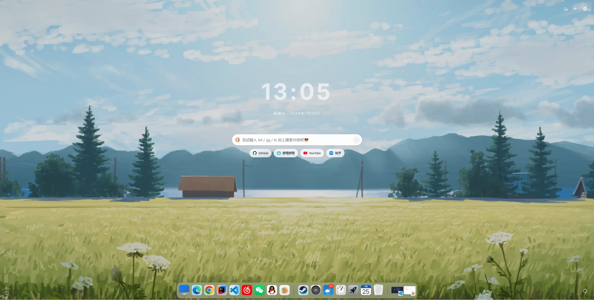

<div align="center">
  
  <h1>LaunchPad</h1>
  <p>想去哪，就去哪。</p>
  <p>一个简洁、可定制的浏览器新标签页，也是一套随时可用的搜索启动器。</p>

  <a href="https://microsoftedge.microsoft.com/addons/detail/launchpad/mooiphlmpfndbnicaeaemmdpnolkhamh"> Edge安装</a> ·
  <a href="https://github.com/rururunu/init-tab/releases/latest">下载最新版</a> ·
  <a href="#使用说明">使用说明</a> ·
  <a href="#本地开发">本地开发</a>
</div>

## 功能亮点

- **全局搜索**：在任意网页按下 `Alt + S`，无需切换标签页即可唤起搜索框。
- **多引擎指令**：使用 `gg`、`bd` 等前缀直达指定搜索引擎，也可以添加自己的搜索网站和指令。
- **AI 直达**：内置 ChatGPT、Gemini、Claude、Kimi、DeepSeek、豆包、通义千问等预设，支持将问题自动填入对话框。
- **收藏夹搜索**：输入 `*` 加关键词，直接搜索浏览器收藏夹。
- **搜索建议**：输入时显示联想词，支持键盘选择和补全。
- **快捷访问**：在搜索框下方放置常用网站，支持自定义、分组、拖动排序，以及从收藏夹或推荐列表快速添加。
- **个性化新标签页**：自由设置时钟、日期、字体、字号、颜色和明暗模式下的显示效果。
- **多种背景**：支持纯色、本地图片、自定义图片链接、Picsum、必应每日和 Wallhaven；在线壁纸可以刷新、收藏和再次应用。
- **配置迁移**：将基础设置、背景、搜索引擎和快捷访问导出为 JSON，并在其他设备导入恢复。

## 安装

LaunchPad 目前以 Chromium 扩展提供，可用于 Chrome、Edge 等兼容浏览器。

如果您使用的试 Edge 可以直接前往 [microsoftedge](https://microsoftedge.microsoft.com/addons/detail/launchpad/mooiphlmpfndbnicaeaemmdpnolkhamh) 直接安装此插件

1. 前往 [Releases](https://github.com/rururunu/init-tab/releases/latest) 下载最新的 `LaunchPad.zip`。
2. 解压下载的文件。
3. 打开浏览器的扩展管理页：Chrome 为 `chrome://extensions`，Edge 为 `edge://extensions`。
4. 开启右上角的「开发者模式」。
5. 点击「加载已解压的扩展程序」，选择刚刚解压的文件夹。
6. 打开一个新标签页，开始使用 LaunchPad。

> 如果 `Alt + S` 与其他软件冲突，可在 `chrome://extensions/shortcuts` 或 `edge://extensions/shortcuts` 中修改快捷键。

## 使用说明

直接输入关键词并按下 `Enter`，会使用当前默认引擎搜索。输入引擎指令后再输入关键词，则会临时使用对应引擎。

| 输入 | 作用 | 示例 |
| --- | --- | --- |
| `关键词` | 使用默认引擎搜索 | `Vue 组件通信` |
| `bd 关键词` | 使用百度搜索 | `bd 北京天气` |
| `gg 关键词` | 使用 Google 搜索 | `gg Vue documentation` |
| `cd` | 从列表中切换默认搜索引擎 | `cd` |
| `*关键词` | 搜索浏览器收藏夹 | `*GitHub` |

### 随时唤起全局搜索

浏览网页时按下 `Alt + S`，LaunchPad 会在当前页面上方显示搜索框。输入关键词、选择搜索建议并回车即可跳转，全程无需离开当前标签页。



### 快速切换默认引擎

输入 `cd` 打开搜索引擎列表，使用方向键选择并按下 `Enter`，之后直接输入的内容都会交给新的默认引擎。



### 直达 AI 对话

添加 AI 搜索预设后，输入对应指令和问题即可打开目标 AI。对于支持填词的站点，LaunchPad 会将问题写入对话框并尝试自动发送。


### 搜索浏览器收藏夹

输入 `*` 后继续输入关键词，即可筛选浏览器收藏夹；选中结果后直接打开，不必再翻找收藏夹目录。



常用键盘操作：

| 按键 | 作用 |
| --- | --- |
| `Alt + S` | 在当前网页唤起全局搜索 |
| `↑` / `↓` | 在建议或引擎列表中移动 |
| `Enter` | 确认选中项或开始搜索 |
| `→` | 用当前建议补全输入框 |
| `Esc` | 关闭下拉列表或搜索浮层 |

搜索引擎、AI 站点、快捷访问和壁纸都可以在右上角的「设置」中调整。首次使用默认提供百度、Google、DuckDuckGo 和 Bing，更多预设可在「搜索引擎」中一键添加。

## 权限说明

LaunchPad 需要读取收藏夹来提供收藏夹搜索和快捷访问推荐，需要在网页中运行内容脚本来显示全局搜索框，并使用本地扩展存储保存配置、图标和壁纸缓存。启用在线壁纸或搜索建议时，浏览器会向所选的第三方服务发起请求。

所有个性化配置默认保存在浏览器本地；需要迁移时，可通过「设置 → 导入导出」手动生成或导入 JSON 文件。

## 本地开发

需要 Node.js 20+ 和 pnpm 10+。

```bash
pnpm install
pnpm dev
```

构建可加载到浏览器的扩展：

```bash
pnpm build
```

构建产物位于 `dist/`。开发前也可以运行完整检查：

```bash
pnpm check
```

## 反馈

遇到问题或有功能建议，欢迎提交 [Issue](https://github.com/rururunu/init-tab/issues)。
